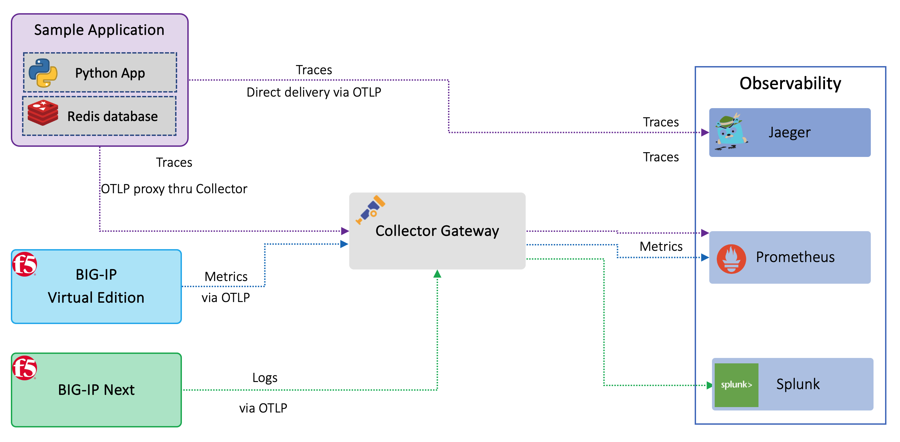

F5 BD OTel Introductory Lab
============================================================================

This self-guided lab is intended to provide a hands-on introduction to Open Telemetry (OTel) concepts and their implementation.  During this lab, attendees will deploy and use the lab infrastructure, (see below) to:
 - #### Gain insight into how applications are instrumented utilizing the Open Telemetry sdk
 - #### Configure telemetry streaming of metrics from F5 BIG-IP utilizing the OTel collector gateway 

As illustrated above, the lab environment consists of the following:
   - 
   - **F5 BIG-IP(s)** providing L4/L7 ADC Services and utilzing F5 Telemetry Streaming**, (TS) to stream telemetry data to an OTel collector gateway
   - **Sample Application** consisting of a python frontend application and a Redis backend database

   - **GitHub Actions** for workflow automation 
   - **Azure** public cloud for application hosting
   - **Hashicorp Terraform** and **Consul** for infrastructure provisioning, service discovery and event logging
   - **Elastic ELK Stack**, (integrated with BIG-IP(s) via TS) for monitoring and alerting
   - **Locust.io** for load generation

#. Deploy a cloud-based application, along with related infrastructure. 

#. Manage autoscaling operations via a centralized ADPM environment and a third party analytics provider, (Elastic ELK stack) for
   monitoring/alerting.

Expected time to complete: **2 hours**

We will be using a jumpbox to connect to the lab environment. Go to the next section for details on how to connect to the lab environment.
