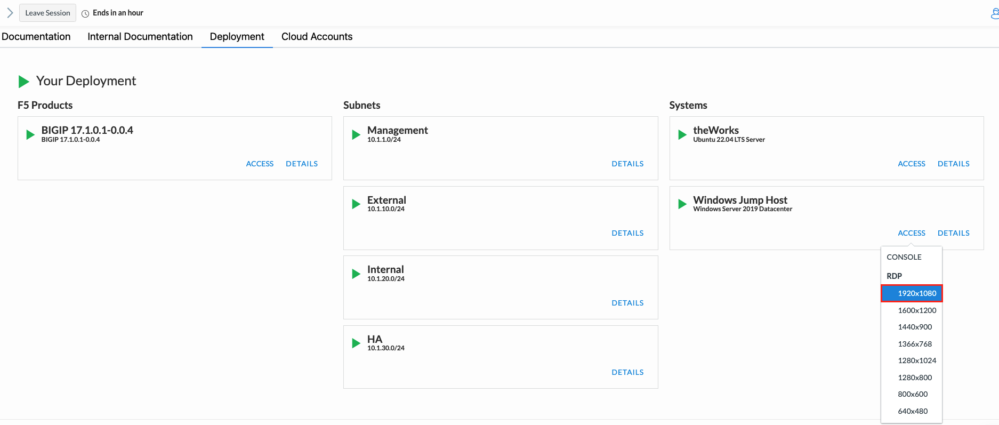
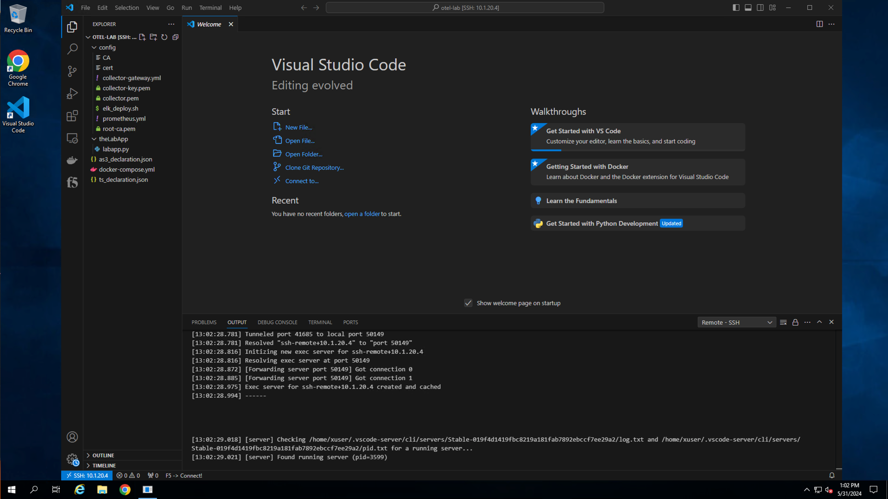
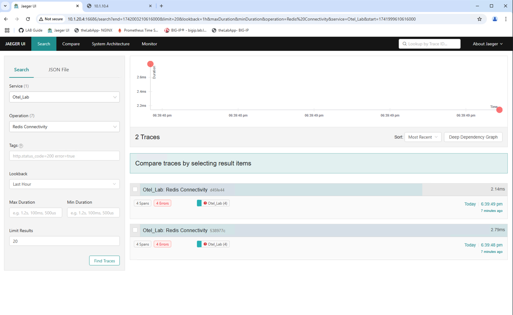
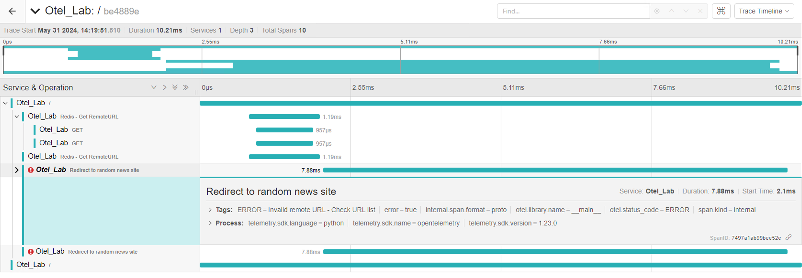

Exercise 1 - App instrumentation walk-through and troubleshooting
============================================================================
### Deploy blueprint and connect to jumpbox

From the [UDF](https://udf.f5.com/blueprints) console, search for and deploy the blueprint entitled *Open Telemetry Introductory*. 
Once the blueprint has finished deploying, access the Windows jump box by selecting the RDP access link, (*see below*).  The jump box will be used to complete all lab exercises.  Credentials for this lab can be viewed by accessing the system(s) **DETAILS** tab.



Upon successful login to the jump box, you will arrive at the Windows server desktop, (see below).


### Review sample application instrumentation

For a system to be observable, it must be instrumented. The code needs to emit traces, metrics, and/or logs.  To accomplish this, the [Open Telemetry](https://opentelemetry.io/) project includes SDKs for a majority of modern programming languages.  For this exercise, a sample application, (***labapp.py***) has been instrumented, using the Open Telemetry Python SDK, to send trace data to a locally running [Jaeger](https://www.jaegertracing.io/) instance.

#### Traces and Spans
A trace is a collection of operations that represents a unique transaction handled by an application and its services. A span represents a single operation within a trace.  

The image below, (*courtesy of [Splunk](https://docs.splunk.com/Observability/apm/apm-spans-traces/traces-spans.html#:~:text=What%20are%20traces%20and%20spans,single%20operation%20within%20a%20trace.)*) shows a trace represented by a series of multicolored bars labeled with the letters A, B, C, D, and E. Each lettered bar represents a single span. The spans are organized to visually represent a hierarchical relationship in which span A is the parent span and the subsequent spans are its children.


A span might refer to another span as its parent, indicating a relationship between operations involved in the trace. In the image above, span A is a parent span, and span B is a child span. 

This relationship could indicate that, for example, span A makes a service call that triggers the operation captured by span B. In this image, span C is also a child of span B, and so on.

### Review the sample application

***Note:** Although a basic understanding of Python may be helpful, this lab assumes no previous coding experience*.

Navigate to and open Visual Studio (VS) Code from the Windows desktop, (see below).  You will be using VS Code to review and edit the application file.  VS Code will be prompt you for user credentials as it creates a remote session with the application server, (theWorks).



With VS Code open, use the navigation pane on the left and open the application file, (theLabApp/labapp.py).  When ran, the application will:

1. Connects to and populates Redis DB container with several new site URLs
1. Randomly selects and retrieves a URL record from the Redis DB
1. Redirects site visitors to the selected URL
1. Creates a local web site located at http://10.1.10.6:8080

With the file open in the viewer, locate and review the various OTel relevant snippets.  


#### OTel SDK module import
Import statements are used to refer to an utilize previously created python modules.  The Open Telemetry SDK includes several submodules which can be imported, (*see below*) depending upon the libraries utilized, services requiring instrumentation, and exporter(s) required.

This application has imports to handle automatic instrumenting of Flask and Request, (*web services*) as well as Redis.  In addition, there are import statements for processors and OTel exporters.


#### Trace provider
The provider section, (*see below*) defines the source of traces that are generated by the application.  In this case, the provider service name has been set to '*Otel_Lab*'.  As the below image illustrates, traces sent to the visibility provider, (Jaeger) are categorized by the service name.


#### OTel exporters
The sample application has been configured with two (2) exporters. Exporters define where the application should direct (*export*) observability data.

Many observability providers have developed custom exporters allowing for direct ingestion of traces, metrics, and/or logs.  In the snippet below, a customer Jaeger exporter has been defined as well as a generic OTLP span exporter.


#### Instrumentation
With the above OTel SDK sections defined in the code, the desired application libraries, calls and functions can be instrumented.  The Open Telemetry SDK supports both automatic instrumentation as well as manual instrumentation.

##### Automatic instrumentation
Many Python modules support automatic instrumentation.  For example, the sample application code makes use of the Redis module/library to connect to and update a Redis database.  By simply including the snippet shown below, relevant tracing data is automatically generated for Redis interactions.


##### Manual instrumentation
You will add in manual instrumentation when either automatic instrumentation is not available  or if you have a desire to configure your own tracing spans.  In the code snippet below, a new span will be generated on line 92.

In addition, metadata such as custom attributes and status codes can be generated.


The screenshot below illustrates how the above manually created instrumentation is generated and rendered in Jaeger.


---
### Troubleshooting - *"Sorry...something must be misconfigured"*
Now that you are equipped with a very limited understanding of how the sample application is instrumented for Open Telemetry, you can start the application.

From the VS Code UI, open a new terminal window via the top menu bar.  From the terminal window start the application by entering the following commands:

```cd theLabApp```

```python3 labapp.py```

The application will start and the exposed endpoint will be presented as shown below.


To test the application, you can select and open the link provided in the terminal window as illustrated above or you can navigate to Google Chrome located on the desktop.  With Chrome opened, open a new tab and navigate to application's published endpoint at http://10.1.1.6:8080.


#### Troubleshoot Redis connectivity



#### Troubleshoot application




---

**Go to [Overview](overview.md)**

**Go to [Exercise 2 - Exporting BIG-IP metrics using the OTel consumer](ex2.md)**

**Go [Home](https://github.com/f5businessdevelopment/bdOtelLab)**