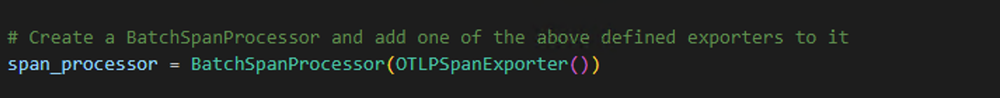
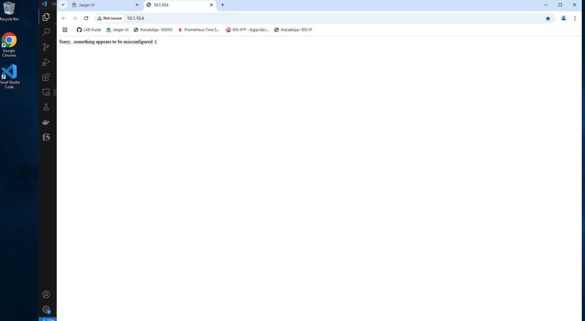
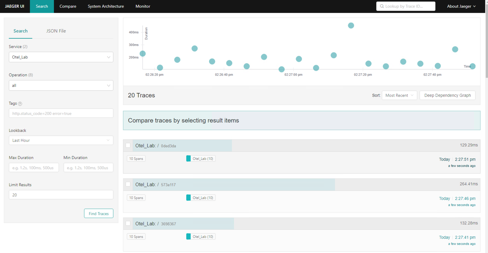

Exercise 1 - App instrumentation walk-through and troubleshooting
============================================================================
###Deploy Blueprint and connect to jumpbox
From the [UDF](https://udf.f5.com/blueprints) console, search for and deploy the blueprint entitled *Open Telemetry Introductory*.

### Review sample application instrumentation
For a system to be observable, it must be instrumented. The code needs to emit traces, metrics, and/or logs.  To accomplish this, the [Open Telemetry](https://opentelemetry.io/) project includes sdks for the majority of modern programming languages.  For this exercise, a sample application, (***labapp.py***) has been instrumented, using the Open Telemetry Python SDK, to send trace data to a locally running [Jaeger](https://www.jaegertracing.io/) instance.

The application does the following:
1. Creates a local web site exposing port 8080,
2. Connects to and populates Redis DB container with several new site URLs,
3. Randomly selects and retrieves a URL record from the Redis DB; and
4. Redirects site visitors to the selected URL.

In addition, the sample application has been instrumented using the Open Telemetry Python SDK.  The purpose of the SDK is to:
- Collect data about the application
- Propagate the context between service(s)
- Ship it somewhere

A trace is a collection of operations that represents a unique transaction handled by an application and its services. A span represents a single operation within a trace.  

The image below, (*courtesy of [Splunk](https://docs.splunk.com/Observability/apm/apm-spans-traces/traces-spans.html#:~:text=What%20are%20traces%20and%20spans,single%20operation%20within%20a%20trace.)*) shows a trace represented by a series of multicolored bars labeled with the letters A, B, C, D, and E. Each lettered bar represents a single span. The spans are organized to visually represent a hierarchical relationship in which span A is the parent span and the subsequent spans are its children.

A span might refer to another span as its parent, indicating a relationship between operations involved in the trace. In the image above, span A is a parent span, and span B is a child span. 

This relationship could indicate that, for example, span A makes a service call that triggers the operation captured by span B. In this image, span C is also a child of span B, and so on.

### Review the sample app

###*"Sorry...something must be misconfigured"* - Application troubleshooting

####Troubleshoot Redis connectivity

####Troubleshoot application

---
**Go to [Overview](overview.md)**

**Go to [Exercise 2 - Exporting BIG-IP metrics using the OTel consumer](ex2.md)**

**Go [Home](https://github.com/f5businessdevelopment/bdOtelLab)**