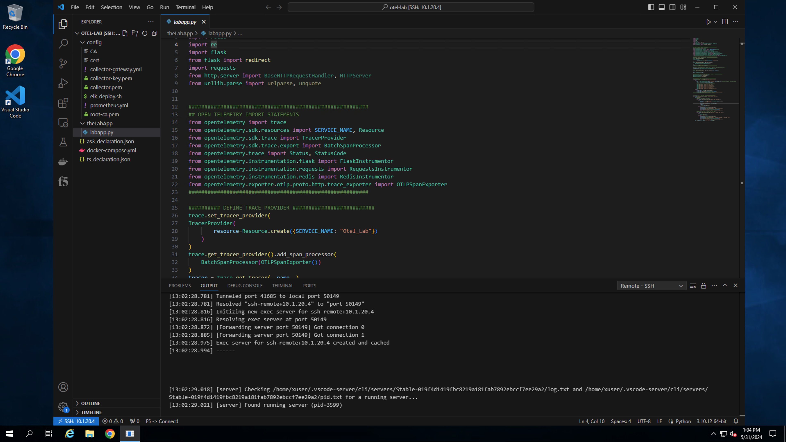
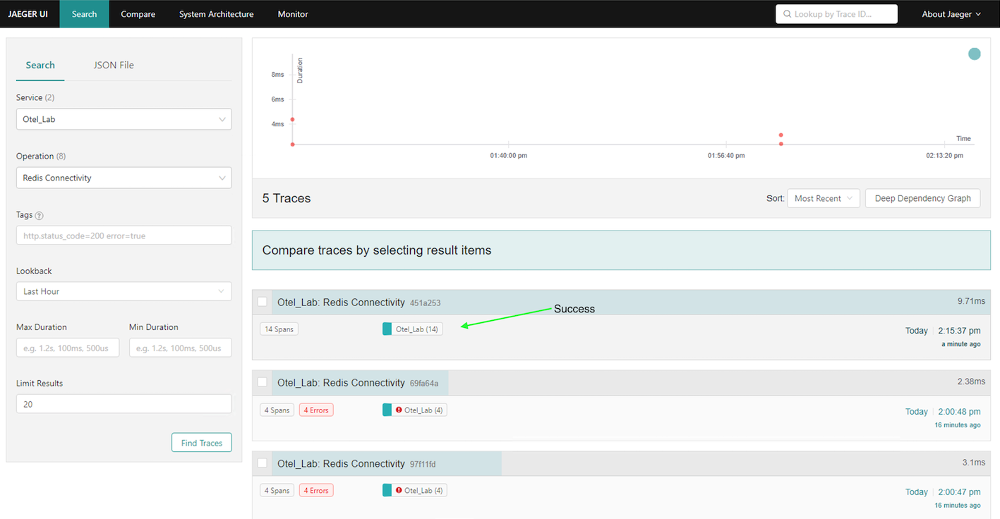
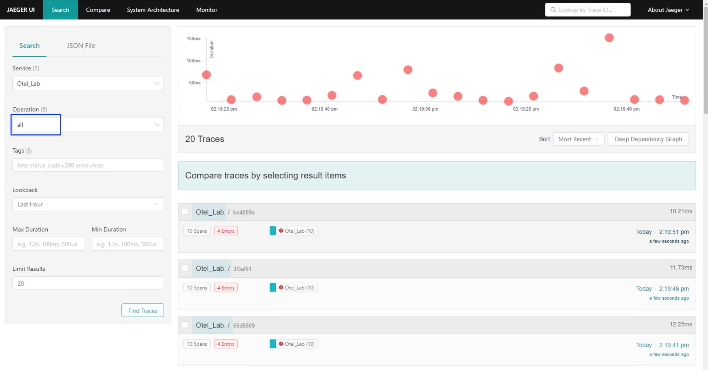

Exercise 1 - App instrumentation walk-through and troubleshooting
============================================================================
###Deploy Blueprint and connect to jumpbox
From the [UDF](https://udf.f5.com/blueprints) console, search for and deploy the blueprint entitled *Open Telemetry Introductory*.

### Review sample application instrumentation
For a system to be observable, it must be instrumented. The code needs to emit traces, metrics, and logs.  To accomplish this, the [Open Telemetry](https://opentelemetry.io/) CNCF project includes sdks for the majority of modern programming languages.  For this exercise, a sample python application, (*labapp.py*) has been provided. The sample application has been instrumented using the Open Telemetry Python SDK.  The purpose of the SDK is to:
- Collect data about the application
- Propagate the context between service
- Ship it somewhere
For this exercise, the application has been instrumented to send trace data, (in the form of spans) to a local running [Jaeger](https://www.jaegertracing.io/) instance.

###*"Sorry...something must be misconfigured"* - Application troubleshooting

####Troubleshoot Redis connectivity

####Troubleshoot application

---
**Go to [Overview](overview.md)**

**Go to [Exercise 2 - Exporting BIG-IP metrics using the OTel consumer](ex2.md)**

**Go [Home](https://github.com/f5businessdevelopment/bdOtelLab)**