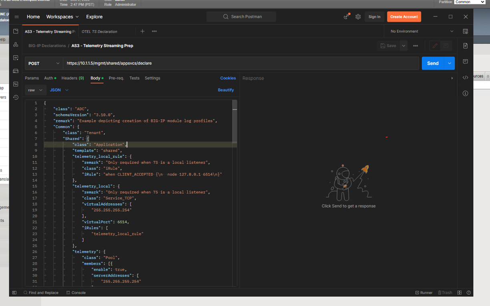
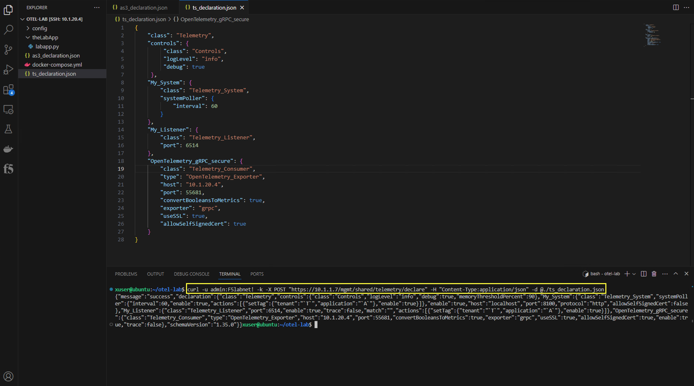
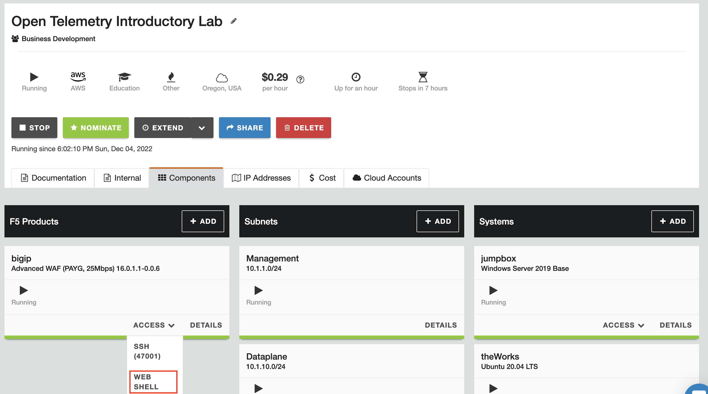
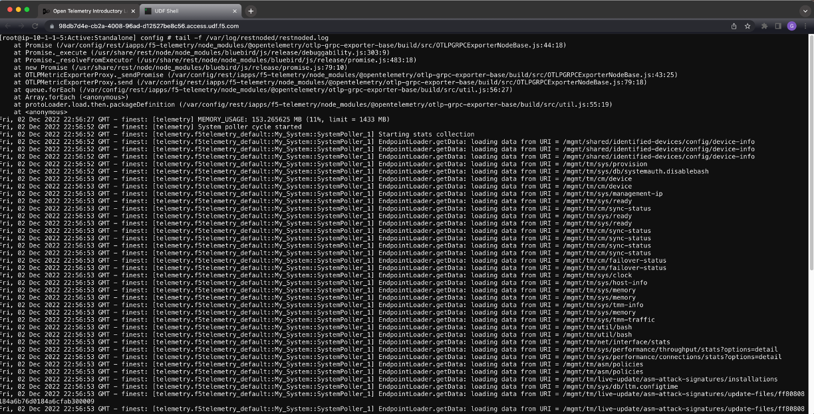
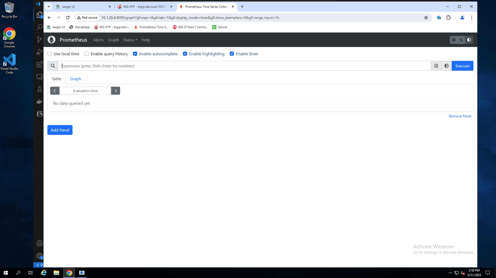
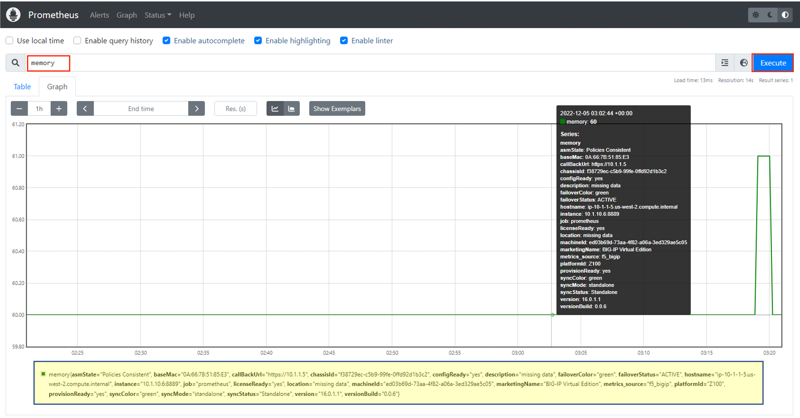

Exercise 2 - Exporting BIG-IP metrics using the OTel consumer
============================================================================

---
**Go to [Overview](overview.md)**

**Go to [Exercise 1 - App instrumentation walk-through and troubleshooting](ex1.md)**

**Go [Home](https://github.com/f5businessdevelopment/bdOtelLab)**