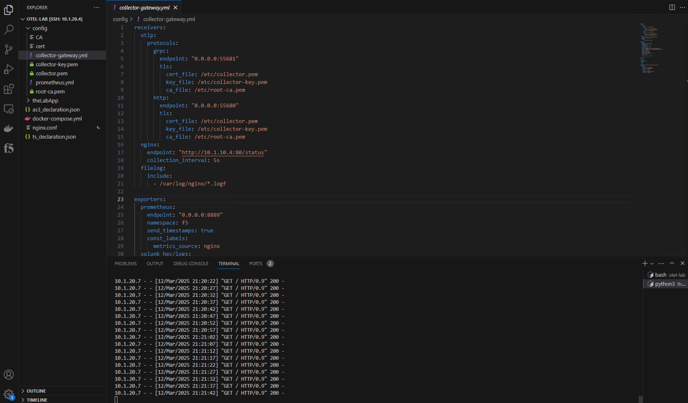

Exercise 2 - Exporting NGINX Plus spans and metrics using Open Telemetry 
============================================================================

### Configure NGINX tracing 

#### Review and update NGINX configuration file

The lab environment includes an NGINX Plus instance that has been configured to publish and provide load balancing to our previously deployed application, (thelabApp).  

NGINX uses a configuration file (nginx.conf) to define its behavior, including server blocks, reverse proxy settings, load balancing, security rules, loggin, and performance optimizations.  During this exercise, you will modify the *nginx.conf* file to enable the sending of trace information, (*spans*) to Jaeger. 

From the VS Code UI use the navigation pane on the left and open the NGINX Plus configuration file, (*nginx.conf*).  Familiarize yourself with the configuration file contents, (see below).  


Several lines related to OTEL integration have been "remmed out".  Let's review the lines and remove the leading '#' to enable to line item.

- Line 2 - The [NGINX Open Telemetry module](https://docs.nginx.com/nginx/admin-guide/dynamic-modules/opentelemetry/) has been installed on the lab NGINX instance.  The module provides OTEL distributed tracing support and must also be loaded via the NGINX configuration.  Remove the leading '#' to enable loading of the module.

- Line 10 - 

- Lines 11 thru 13 - 

- Line 22 - 

- Lines 25 thru 27 - 

With the above noted file lines updated, save the file and use the following command to verify and reload the NGINX configuration - ```sudo nginx -t && sudo nginx -s reload```. 

### Configure NGINX Metrics
#### Review OTel Collector configuration

The OpenTelemetry Collector service provides a vendor-agnostic proxy to receive, process and export observability data.  The collector supports open-source observability data formats (e.g. Jaeger, Prometheus, Fluent Bit, etc.) sending to one or more open-source or commercial back-ends.

The OTel collector is managed via a user-readable YAML configuration file.  At a minimum, the configuration must include the following three sections:
- **Receivers** - section with information related to how the collector will receive observability data, (i.e. protocols, endpoint addresses, ports) 

- **Processors** - section with configuration information related to data manipulation and insertion.  In this section, one can add/delete/modify data streams using filters.

- **Exporters** - section including information related push or pull based backends/destinations

From the VS Code UI use the navigation pane on the left and open the OTel collector gateway configuration file, (*collector-gateway.yml*).  Familiarize yourself with the configuration file contents.  Specific to this exercise, the collector configuration file, (*example below*)  has been configured to:
 - Receive telemetry from a published NGINX status page
 - Process records using the standard batch processor
 - Export metrics to a Prometheus backend




**Go to [Exercise 3 - Exporting BIG-IP metrics using the OTel consumer](ex3.md)**

**Go to [Overview](overview.md)**

**Go [Home](https://github.com/f5businessdevelopment/bdOtelLab)**
