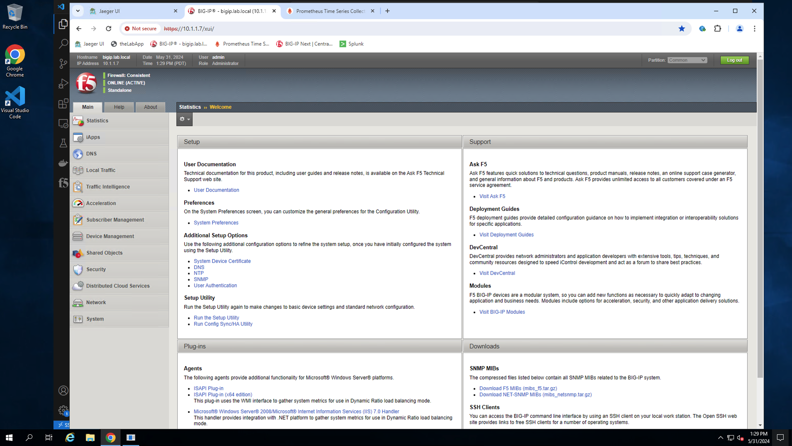
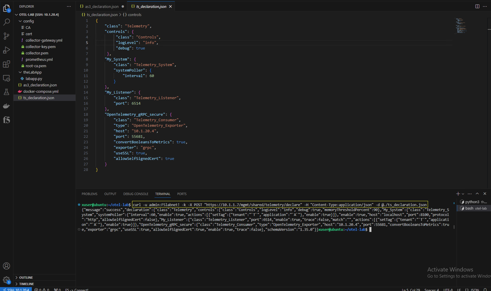

Exercise 2 - Exporting BIG-IP metrics using the OTel consumer
============================================================================

During this exercise, you will configure a BIG-IP virtual edition, (using AS3 and Telemetry Streaming) to send metrics to a locally installed Prometheus instance by way of an OpenTelemetry collector.

The OpenTelemetry Collector service provides a vendor-agnostic proxy to receive, process and export observability data.  The collector supports open-source observability data formats (e.g. Jaeger, Prometheus, Fluent Bit, etc.) sending to one or more open-source or commercial back-ends.

The OTel collector is managed via a user-readable YAML configuration file.  At a minimum, the configuration must include the following three sections:
- **Receivers** - section with information related to how the collector will receive observability data, (i.e. protocols, endpoint addresses, ports) 

- **Processors** - section with configuration information related to data manipulation and insertion.  In this section, one can add/delete/modify data streams using filters.

- **Exporters** - section including information related push or pull based backends/destinations

#### Review OTel Collector configuration

From the VS Code UI use the navigation pane on the left and open the OTel collector gateway configuration file, (*collector-gateway.yml*).  Familiarize yourself with the configuration file contents.  The collector configuration file, (*example below*)  has been configured to:
 - Receive telemetry via OTLP over either HTTP or gRPC
 - Process records using the standard batch processor
 - Export traces to a Jaeger backend and metrics to a Prometheus backend


Once you have familiarized yourself with the OTel collector configuration, use Google Chrome to navigate to the lab BIG-IP UI.  Login using the credentials available on the UDF details tab and review the current BIG-IP configuration.



#### Configure the BIG-IP for telemetry streaming

You will now configure the lab BIG-IP with the necessary resources to send metrics to the OTel collector receiver endpoint.  This can be easily accomplished by applying Applications Services 3 extension (AS3) and Telemetry Streaming (TS) declarations.  You will apply the declarations using curl commands from the VSCode editor.

##### AS3 declaration

Review the provided AS3 declaration. The declaration will deploy remote logging resources, (publishers, virtual, profiles, etc.) required for remote logging capture and transmission. From the VS Code UI open a new terminal tab and use the following curl command to post the declaration.

*curl -u admin:F5labnet! -k -X POST "https://10.1.1.7/mgmt/shared/appsvcs/declare" -H "Content-Type:application/json" -d @./as3_declaration.json*


##### TS declaration

Review the provided TS declaration.  The declaration configures the telemetry streaming service to push events to an OTel collector.  The OTel collector consumer is limited to delivering metrics.  The consumer is configured to use the OTLP protocol over gRPC with the standard port of 4317.  POST the provided declaration with the below command.

*curl -u admin:F5labnet! -k -X POST "https://10.1.1.7/mgmt/shared/telemetry/declare" -H "Content-Type:application/json" -d @./ts_declaration.json*



#### Verify data delivery

The BIG-IP is now configured to send telemetry.  If not currently opened, open Google Chrome from the desktop and select the  Prometheus tab.  If the tab is no longer visible, the Prometheus UI is located at http://10.1.20.4:9090.


To perform a quick test on the system, select the *Graph* tab and enter 'f5-system_memory' in the search bar; click on 'Execute'.  

The system will query metrics for the BIG-IP system memory metric and return a relevant time chart, (*see below*).

**Note:** *It may take SEVERAL MINUTES for the metrics to begin appearing in Prometheus.*


To verify metrics are being generated by the BIG-IP, navigate out of the RDP jump box and access the BIG-IP's web shell from the UDF console, (*see below*).


From the BIG-IP command line, view the *restnoded.log* file.

```tail -f /var/log/restnoded/restnoded.log```

By tailing the *restnoded.log* file you can view rest API events on the BIG-IP as the occur.  As the below example shows, the log periodically records the system poller as it gathers metrics from the various BIG-IP collection endpoints.  In addition any TS connectivity issues or other configuration issues will be recorded here.  


This concludes Exercise 2.

---

**Go to [Exercise 3 - Exporting BIG-IP metrics using the OTel consumer](ex3.md)**

**Go to [Overview](overview.md)**

**Go [Home](https://github.com/f5businessdevelopment/bdOtelLab)**

