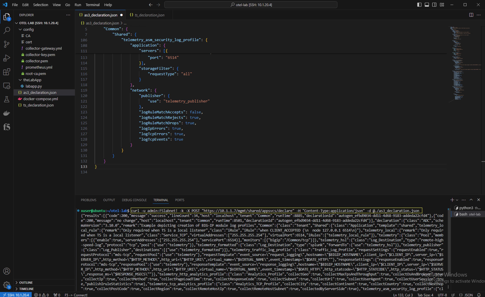
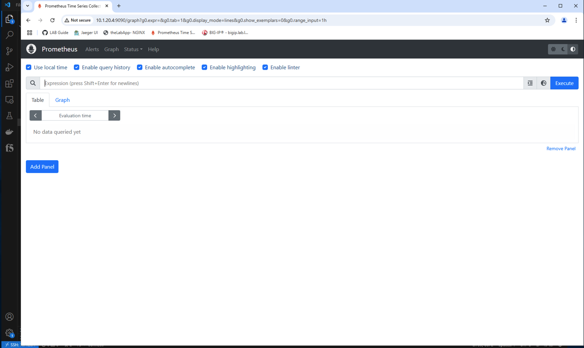
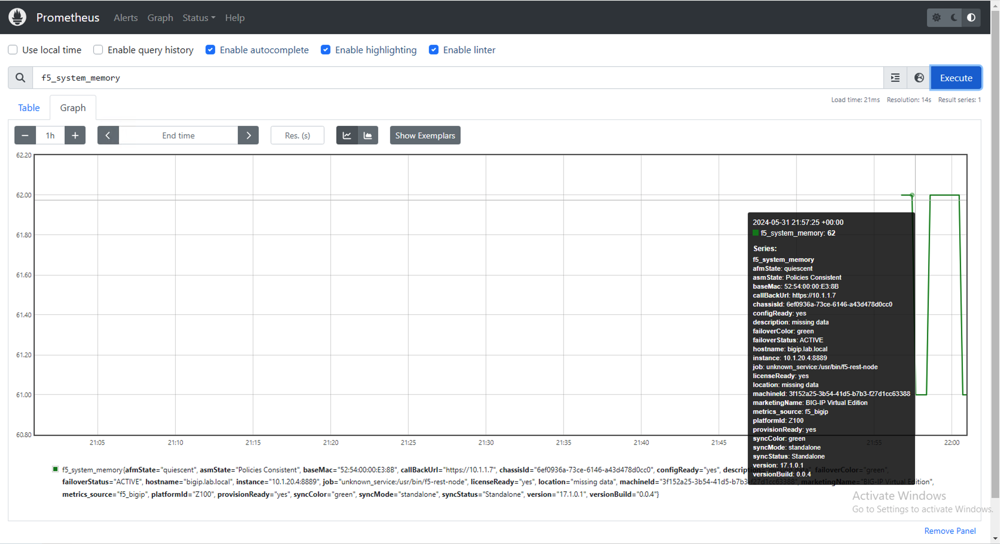

Exercise 2 - Exporting BIG-IP metrics using the OTel consumer
============================================================================

During this exercise, you will configure a BIG-IP virtual edition, (using AS3 and Telemetry Streaming) to send metrics to a locally installed Prometheus instance by way of an OpenTelemetry collector.

The OpenTelemetry Collector offers a vendor-agnostic implementation of how to receive, process and export telemetry data. It removes the need to run, operate, and maintain multiple agents/collectors. This works with improved scalability and supports open-source observability data formats (e.g. Jaeger, Prometheus, Fluent Bit, etc.) sending to one or more open-source or commercial back-ends. The local Collector agent is the default location to which instrumentation libraries export their telemetry data.

#### Review OTel Collector configuration

From the VS Code UI use the navigation pane on the left and open the OTel collector gateway configuration file, (*collector-gateway.yml*).

---

**Go [Home](https://github.com/f5businessdevelopment/bdOtelLab)**

**Go to [Exercise 1 - App instrumentation walk-through and troubleshooting](ex1.md)**

**Go to [Overview](overview.md)**

