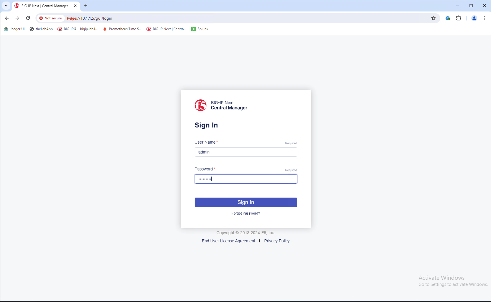
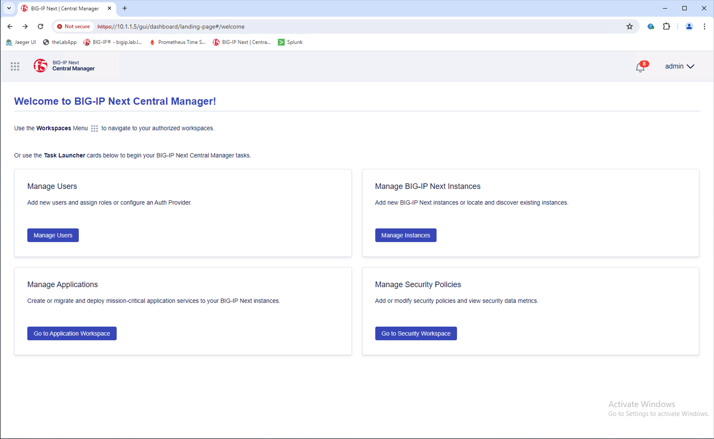
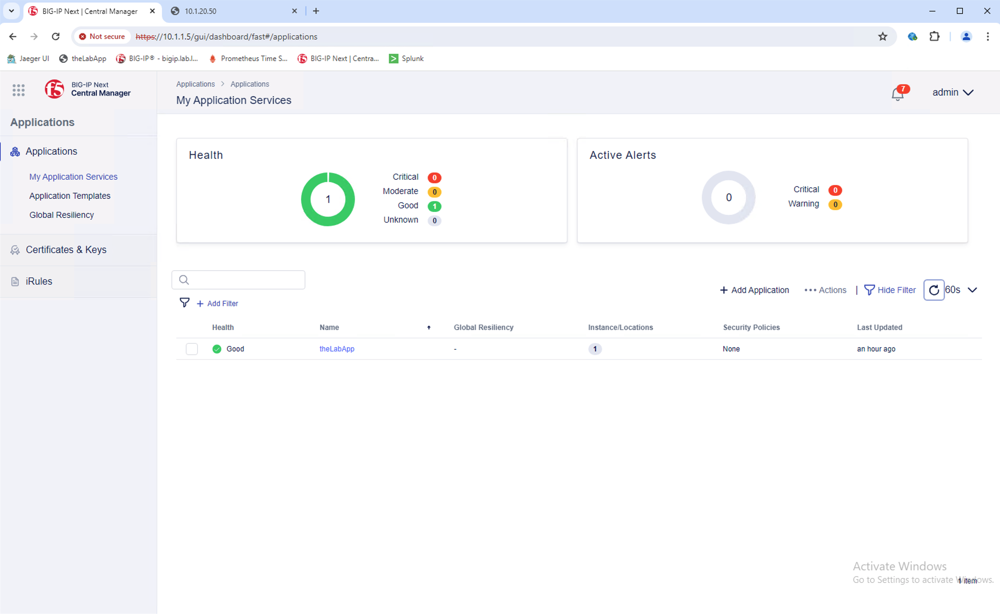
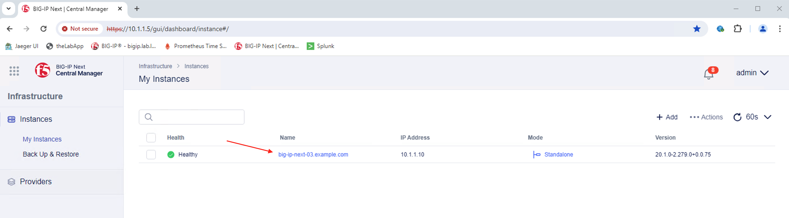
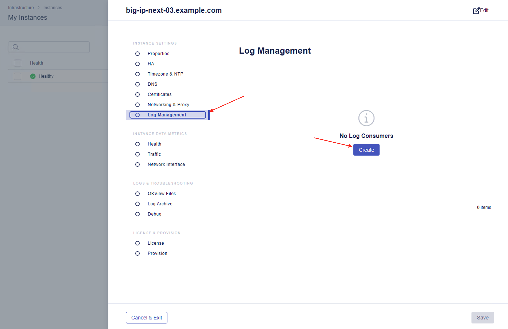
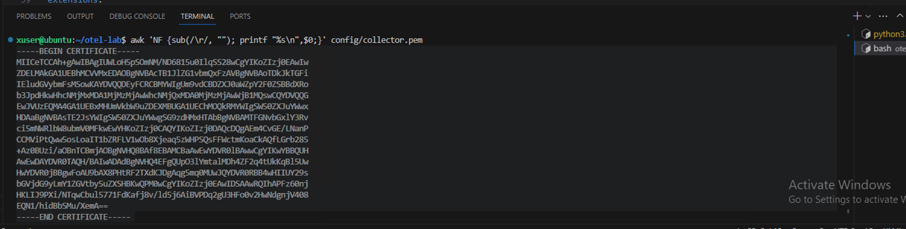
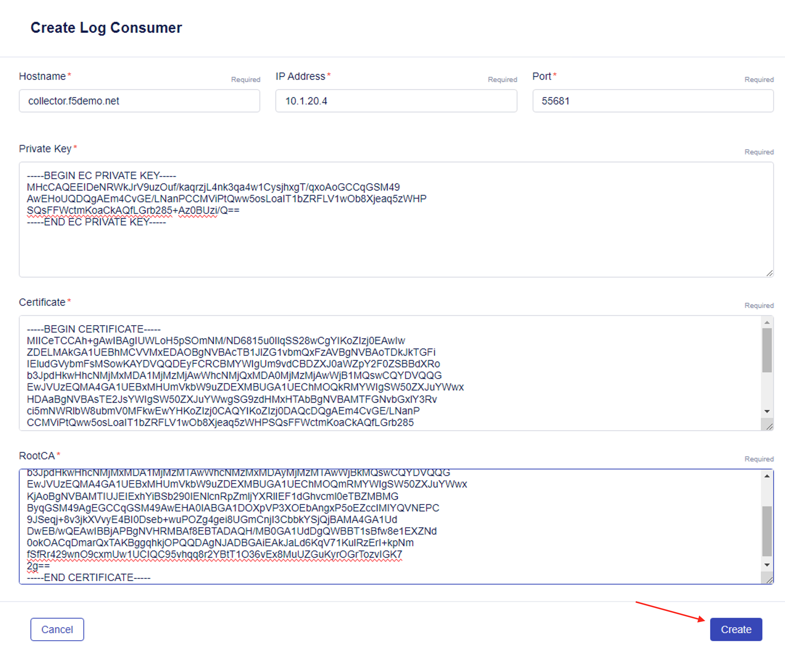
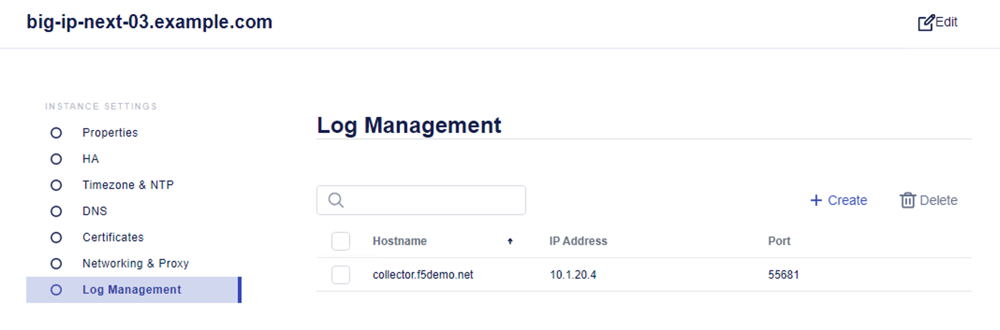
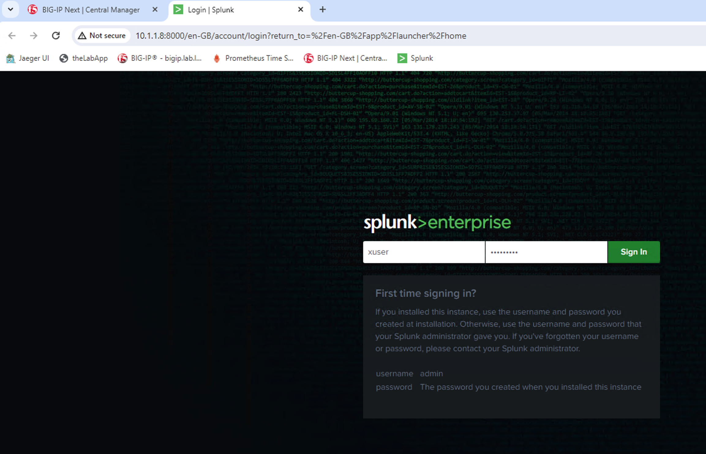
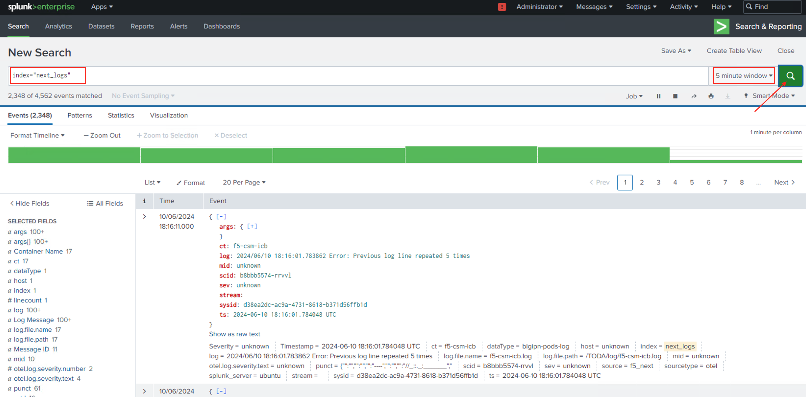

Exercise 3 - Exporting BIG-IP Next logs using Open Telemetry
============================================================================

During this exercise, you will be using BIG-IP Next Central Manager to configure a BIG-IP Next instance to send logs to a locally installed Splunk Enterprise instance by way of the OpenTelemetry collector.

The OpenTelemetry Collector has been configured, as noted earlier, with a Splunk logs exporter, (see below).  


You will use BIG-IP Next Central Manager to configure remote logging for one of the managed BIG-IP Next Instances.  





Take a few minutes to explore the UI.  This BIG-IP Next environment includes, in addition to the Central Manager, a single BIG-IP Next instance hosting a single application deployment, theLabApp.  

If your example application is still running, you should see the application with a *Good* health, (see below).



From the '*Manage Instances*' section, select the existing instance, *'big-ip-next-03.example.com'* and open to view the instance details.



##### Create Log Consumer

From the instance details, navigate to '*Log Management*' and select '*Create*'.



Complete the required fields using the following values below to send logs to the OTel collector.
- Hostname: **collector.f5demo.net**
- IP Address: **10.1.20.4**
- Port: **55681**

You will need to convert and provide the collector's cert/key and root certificate in single-line format, (see below).  



Us the VSCode terminal window run the following commands and paste the outputs in the appropriate log consumer fields.

```awk 'NF {sub(/\r/, ""); printf "%s\n",$0;}' /home/xuser/otel-lab/config/collector-key.pem```

```awk 'NF {sub(/\r/, ""); printf "%s\n",$0;}' /home/xuser/otel-lab/config/collector.pem``` 

```awk 'NF {sub(/\r/, ""); printf "%s\n",$0;}' /home/xuser/otel-lab/config/root-ca.pem``` 

With the fields completed, select '*Create*' to generate the log consumer.





##### Validate Log ingestion into Splunk Enterprise

The last step in this lab it to verify logs are arriving at Splunk.  From the Chrome browser, select '*Splunk*' from the bookmarks bar and login using the credentials available on the UDF Splunk details tab.



Select *Search & Reporting*.  On the search bar enter '**index="next_logs"**' for the query, '**5 minute window**' for the time period and click on the magnifying glass icon to perform the query.

If successfully configured, you should see results similar to the below example.  Congratulations!  You have completed the course.



**Go to [Exercise 2 - Exporting BIG-IP metrics using the OTel consumer](ex2.md)**

**Go to [Overview](overview.md)**

**Go [Home](https://github.com/f5businessdevelopment/bdOtelLab)**