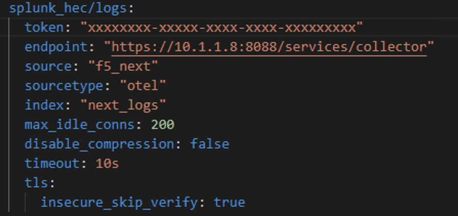

Exercise 3 - Exporting BIG-IP Next logs using Open Telemetry
============================================================================

During this exercise, you will be using BIG-IP Next Central Manager to configure a BIG-IP Next instance to send logs to a locally installed Splunk Enterprise instance by way of the OpenTelemetry collector.

The OpenTelemetry Collector service provides a vendor-agnostic proxy to receive, process and export observability data.  The collector supports open-source observability data formats (e.g. Jaeger, Prometheus, Fluent Bit, etc.) sending to one or more open-source or commercial back-ends.

**Go to [Overview](overview.md)**

**Go [Home](https://github.com/f5businessdevelopment/bdOtelLab)**